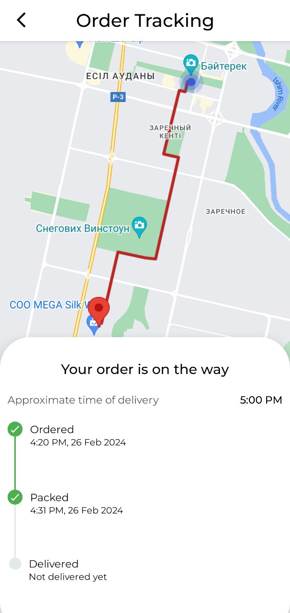

# Crocos Test Task
### Получение данных
В данный момент данные генируются согласно ТЗ локально на устройстве пользователя, однако их источник легко заменить например на API бекенда, для этого достаточно изменить  *OrderRepositoryImpl*, и модели данных без проблем дойдут до конечного слоя представления. Гибкость и изменяемость достигается за счет архитектурного подход Clean Architecture.
```
object OrderRepositoryImpl : OrdersRepository{
    private val mapper = OrderMapper()
    private val someDataSource = SomeDataSource() - Retrofit, Room, Firebase либо все что угодно

    override fun getOrderList(): List<Order> {
        return mapper.mapEntityListToModel(dataSource.getOrderList())
    }

    override fun getOrderByOrderId(orderId: Long): Order {
        return mapper.mapEntityToModel(dataSource.getOrder(orderId: Long))
    }
}
```

---
### Работа с картой
В приложении отображается самый оптимальный маршрут от ресторана до заказчика, для этого используется Directions API от Google. Запрос на маршурт принимает начальную и конечную точку, они могут быть представлены в разных форматах, адрес, идентификатор места или координаты широты и долготы, все зависит от требований и API бекенда.

### Доработки на будущее
Отображение местоположение курьера в реальном времени реализовать не сложно, для этого необходимо подключить Firebase Realtime и считывать данные о текущем местонахождении курерьра с его устройства, за счет слушателя изменений в БД на устройстве заказчика можно отрисовывать новую точку после каждого изменеия.
<p align="start">
 
</p>

---
### Напоминание при клонировании
После клонирования проект сам по себе не запустится, так как вылезет ошибка об отсутствии API ключа, потому что мой ключ спрятан в *secrets.properties* проекта. Данную строчку когда внутри *ApiService* нужно заменить на ваш API-ключ, для которого включен Google Map API и Directions API.
```
interface ApiService {

    @GET("/maps/api/directions/json")
    suspend fun getDirections(
        @Query("origin") origin: String,
        @Query("destination") destination: String,
        @Query("key") apiKey: String = API_KEY
    ): Response<DirectionResponse>


    companion object{
        private const val API_KEY = BuildConfig.MAPS_API_KEY --------------------------- ВАШ API-КЛЮЧ ДОЛЖЕН БЫТЬ ЗДЕСЬ
    }
}
```
